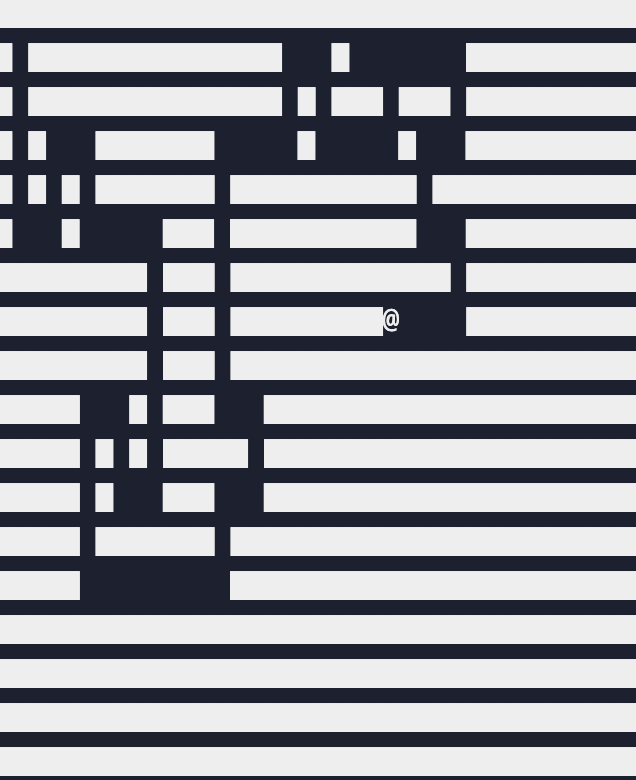

## Preview



# Recursive Maze Generator

A simple maze generator built in **Python** using the **Recursive Backtracking** algorithm (a randomized version of **Depth-First Search**).

The program starts with a grid completely filled with walls and gradually carves paths by recursively visiting neighboring cells until the entire maze has been explored. Every time the program runs with a different random seed, it generates a new maze.

This project helped me understand how recursion, graph traversal, and backtracking can be used to solve real-world problems like procedural maze generation.

---

# Features

* Generates a random maze
* Uses Recursive Backtracking (DFS)
* Displays the maze in the terminal
* Configurable maze size
* Reproducible output using a random seed
* Lightweight implementation using only Python's standard library

---

# Technologies Used

* Python 3
* `random` module

---

# Project Structure

```text
maze_generator.py
│
├── Maze initialization
├── Maze printing function
├── Recursive DFS algorithm
├── Backtracking logic
└── Final maze generation
```

---

# How It Works

The maze generation process follows these steps:

1. Create a grid filled entirely with walls.
2. Start from the top-left corner.
3. Mark the current cell as visited.
4. Randomly choose one of the unvisited neighboring cells.
5. Remove the wall between the two cells.
6. Move to the new cell and repeat the process.
7. If there are no unvisited neighbors, backtrack to the previous cell.
8. Continue until every cell has been visited.

---

# Algorithm Flow

```text
Start

↓

Fill Grid With Walls

↓

Choose Starting Cell

↓

Visit Cell

↓

Find Unvisited Neighbors

↓

Remove Wall

↓

Move Forward

↓

No Neighbors?

↓

Yes → Backtrack

↓

No → Continue Exploring

↓

Maze Complete
```

---

# Concepts Used

This project demonstrates several important computer science concepts:

* Recursion
* Depth-First Search (DFS)
* Backtracking
* Randomized Algorithms
* Graph Traversal
* Dictionaries in Python

---

# Time Complexity

| Operation       | Complexity |
| --------------- | ---------- |
| Maze Generation | O(N)       |

Each cell is visited only once, making the algorithm efficient even for larger mazes.

---

# Space Complexity

| Resource             | Complexity        |
| -------------------- | ----------------- |
| Maze Storage         | O(N)              |
| Visited Cells        | O(N)              |
| Recursive Call Stack | O(N) (worst case) |

---

# Example Output

```text
███████████████████████████████
█     █       █         █     █
█ ███ █ █████ █ ███████ █ ███ █
█ █   █     █ █     █   █   █ █
█ █ ███████ █ ███ ███ █████ ███
█ █       █     █       █     █
███████████████████████████████
```

Every maze is unique when the random seed changes.

---

# Running the Project

Clone the repository:

```bash
git clone https://github.com/yourusername/recursive-maze-generator.git
```

Navigate to the project:

```bash
cd recursive-maze-generator
```

Run the program:

```bash
python maze_generator.py
```

---

# Future Improvements

Some ideas to extend this project include:

* Add a graphical interface using Pygame
* Animate the maze generation process
* Allow the user to choose the maze size
* Implement a maze-solving algorithm
* Save generated mazes as images

---

# What I Learned

While building this project, I learned:

* How recursive functions work
* How Depth-First Search explores a graph
* How backtracking helps solve recursive problems
* How randomness can generate different maze layouts
* How to represent a maze using Python dictionaries

---

# Conclusion

This project was a great way to explore recursion and graph traversal in a practical setting. It showed me how a relatively simple algorithm can generate complex and unique mazes efficiently. It also strengthened my understanding of recursive programming, backtracking, and problem-solving using Python.

I built this project as part of my learning journey in algorithms and data structures, and it gave me a much better understanding of how recursive search algorithms work in practice.
